# 中文代码补全

无须切换输入法，高效补全中文变量、方法与类名，提升中文编码体验。

## 简介

**中文命名的高效补全** —— 变量、函数、类名无需切换输入法即可直接输入，命名与注释仍使用你习惯的输入法。

支持拼音、五笔等多种输入习惯，**只需一次选择，插件即自动加载对应码表并配置好补全逻辑**。

## 支持的语言

### Python

[语言插件](https://marketplace.visualstudio.com/items?itemName=ms-python.vscode-pylance)&nbsp;&nbsp;&nbsp;&nbsp;
[完整样例](https://gitee.com/remyzane/vscode-zh-completion/tree/main/sample/Python)&nbsp;&nbsp;&nbsp;&nbsp;
[效果图](https://gitee.com/remyzane/vscode-zh-completion/blob/main/images/Python.png) 
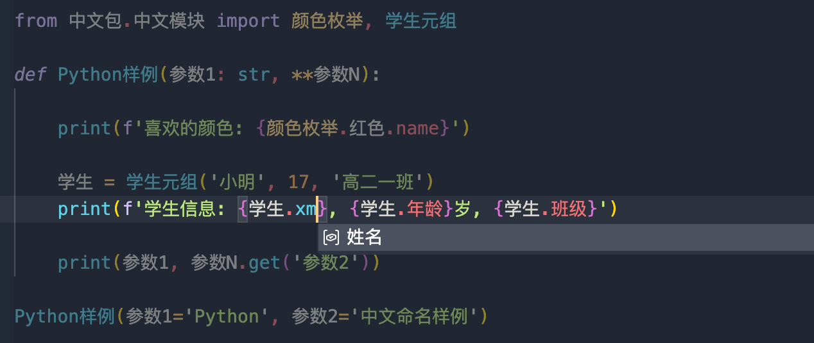

### SQL

[语言插件](https://marketplace.visualstudio.com/items?itemName=cweijan.vscode-database-client2)&nbsp;&nbsp;&nbsp;&nbsp;
[完整样例](https://gitee.com/remyzane/vscode-zh-completion/tree/main/sample/SQL)&nbsp;&nbsp;&nbsp;&nbsp;
[效果图](https://gitee.com/remyzane/vscode-zh-completion/blob/main/images/SQL.png) 

### JavaScript

[语言插件](https://marketplace.visualstudio.com/items?itemName=ms-vscode.vscode-typescript-next)&nbsp;&nbsp;&nbsp;&nbsp;
[完整样例](https://gitee.com/remyzane/vscode-zh-completion/tree/main/sample/JavaScript)&nbsp;&nbsp;&nbsp;&nbsp;
[效果图](https://gitee.com/remyzane/vscode-zh-completion/blob/main/images/JavaScript.png) 
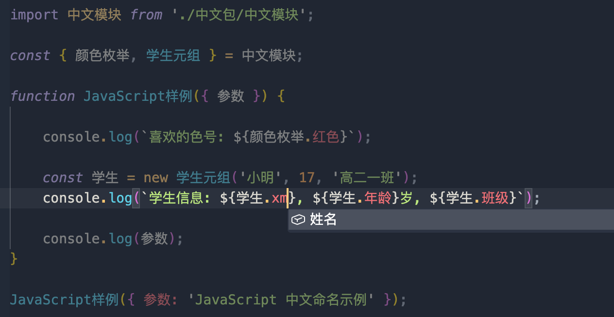

### TypeScript

[语言插件](https://marketplace.visualstudio.com/items?itemName=ms-vscode.vscode-typescript-next)&nbsp;&nbsp;&nbsp;&nbsp;
[完整样例](https://gitee.com/remyzane/vscode-zh-completion/tree/main/sample/TypeScript)&nbsp;&nbsp;&nbsp;&nbsp;
[效果图](https://gitee.com/remyzane/vscode-zh-completion/blob/main/images/TypeScript.png) 
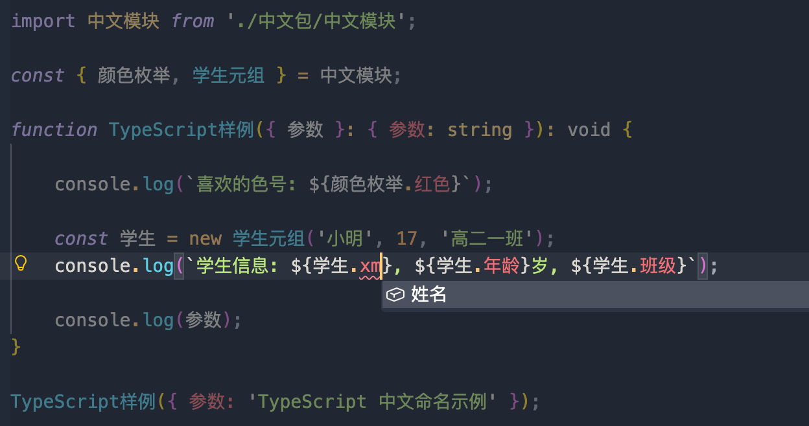

### JSON

[完整样例](https://gitee.com/remyzane/vscode-zh-completion/tree/main/sample/JSON)&nbsp;&nbsp;&nbsp;&nbsp;
[效果图](https://gitee.com/remyzane/vscode-zh-completion/blob/main/images/JSON.png) 
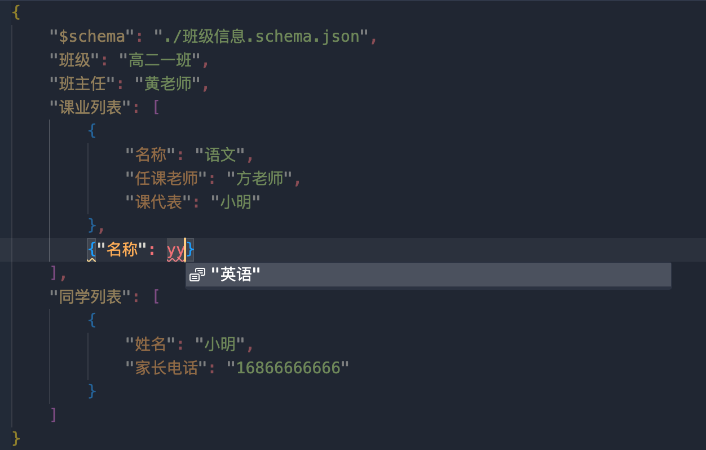
_JSON 无需安装语言支持插件（VSCode 原生支持）_

### Java

[语言插件](https://marketplace.visualstudio.com/items?itemName=redhat.java)&nbsp;&nbsp;&nbsp;&nbsp;
[完整样例](https://gitee.com/remyzane/vscode-zh-completion/tree/main/sample/Java)&nbsp;&nbsp;&nbsp;&nbsp;
[效果图](https://gitee.com/remyzane/vscode-zh-completion/blob/main/images/Java.png) 
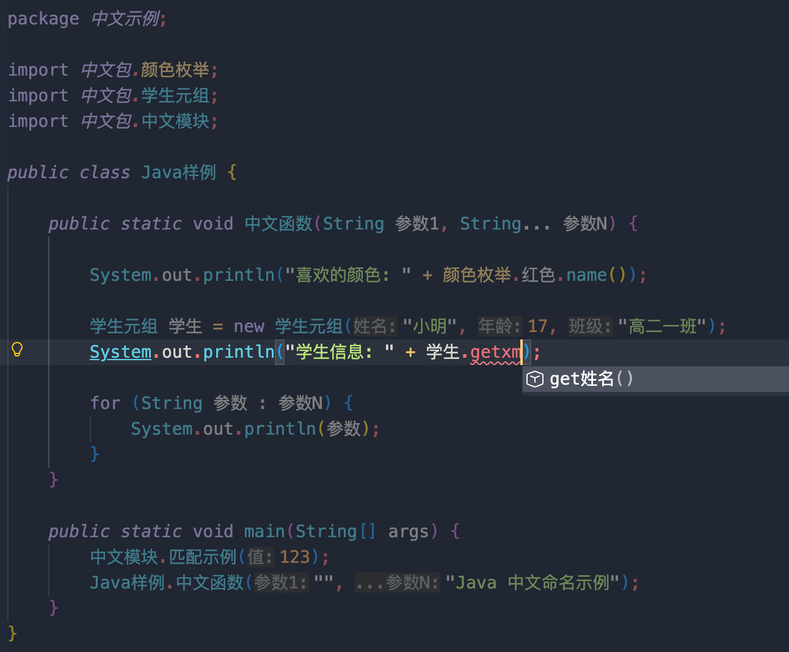

### XML

[语言插件](https://marketplace.visualstudio.com/items?itemName=redhat.vscode-xml)&nbsp;&nbsp;&nbsp;&nbsp;
[完整样例](https://gitee.com/remyzane/vscode-zh-completion/tree/main/sample/XML)&nbsp;&nbsp;&nbsp;&nbsp;
[效果图](https://gitee.com/remyzane/vscode-zh-completion/blob/main/images/XML.png) 
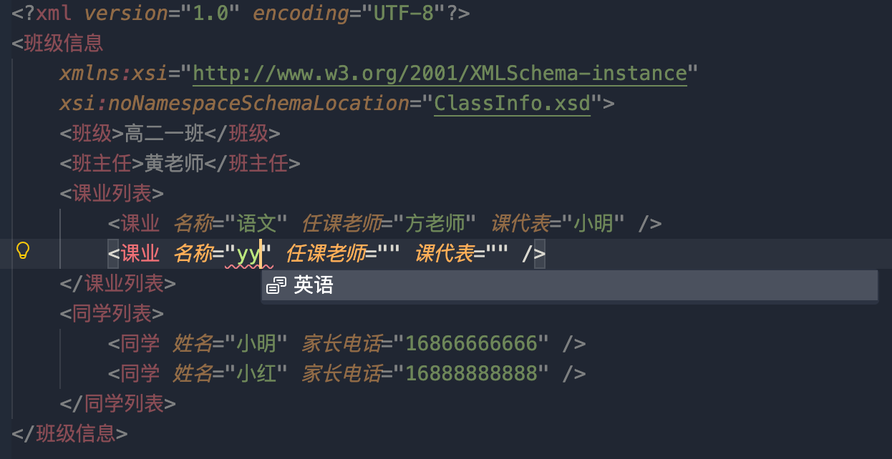

### C 语言

[语言插件](https://marketplace.visualstudio.com/items?itemName=llvm-vs-code-extensions.vscode-clangd)&nbsp;&nbsp;&nbsp;&nbsp;
[完整样例](https://gitee.com/remyzane/vscode-zh-completion/tree/main/sample/C)&nbsp;&nbsp;&nbsp;&nbsp;
[效果图](https://gitee.com/remyzane/vscode-zh-completion/blob/main/images/C.png) 
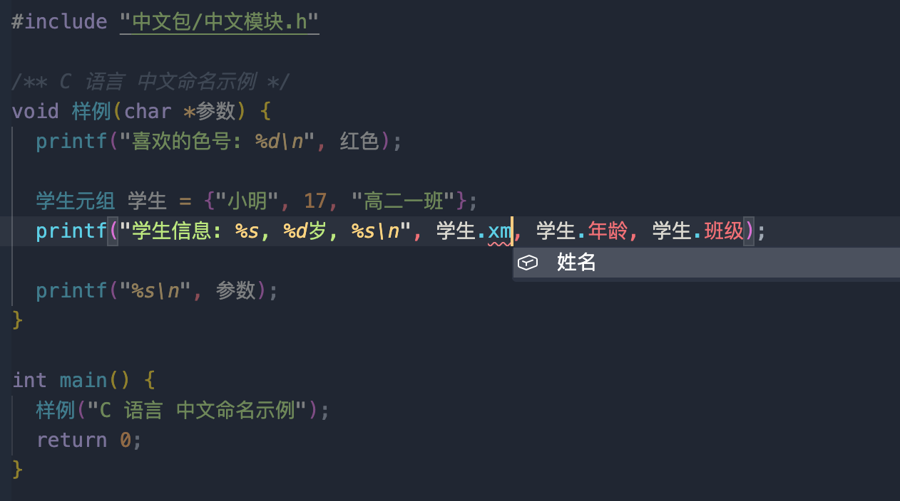
_语言插件请勿使用 cpptools（补全功能不完整）_

### C++

[语言插件](https://marketplace.visualstudio.com/items?itemName=llvm-vs-code-extensions.vscode-clangd)&nbsp;&nbsp;&nbsp;&nbsp;
[完整样例](https://gitee.com/remyzane/vscode-zh-completion/tree/main/sample/C++)&nbsp;&nbsp;&nbsp;&nbsp;
[效果图](https://gitee.com/remyzane/vscode-zh-completion/blob/main/images/C++.png) 
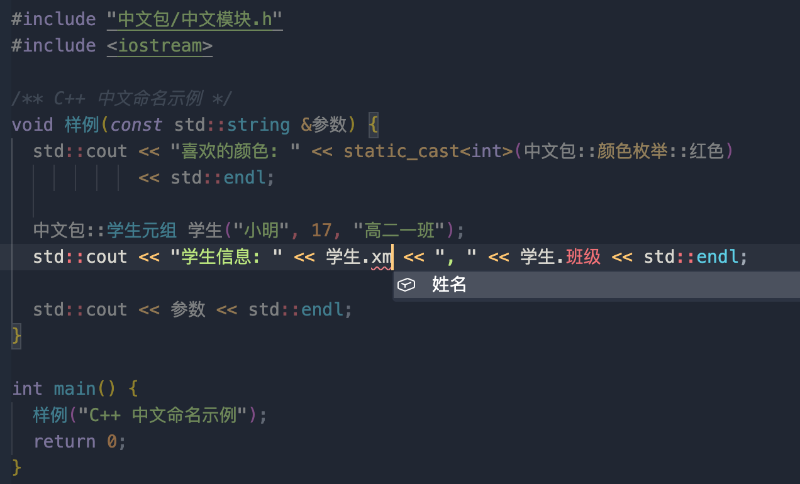

### C#

[语言插件](https://marketplace.visualstudio.com/items?itemName=ms-dotnettools.csharp)&nbsp;&nbsp;&nbsp;&nbsp;
[完整样例](https://gitee.com/remyzane/vscode-zh-completion/tree/main/sample/C#)&nbsp;&nbsp;&nbsp;&nbsp;
[效果图](https://gitee.com/remyzane/vscode-zh-completion/blob/main/images/C%23.png) 

### Rust

[语言插件](https://marketplace.visualstudio.com/items?itemName=rust-lang.rust-analyzer)&nbsp;&nbsp;&nbsp;&nbsp;
[完整样例](https://gitee.com/remyzane/vscode-zh-completion/tree/main/sample/Rust)&nbsp;&nbsp;&nbsp;&nbsp;
[效果图](https://gitee.com/remyzane/vscode-zh-completion/blob/main/images/Rust.png) 
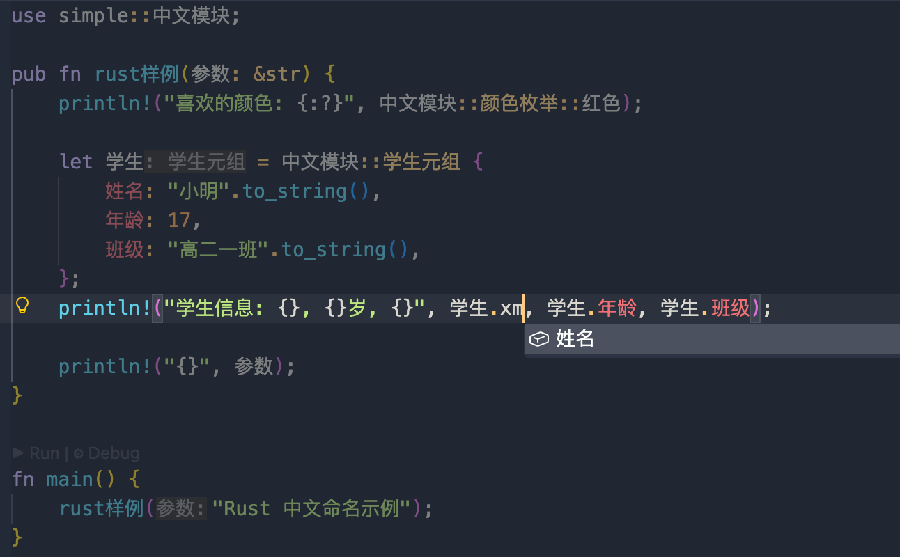
_如果 Rust 插件当前版本原问题（如 v0.3.2735 输入 self.基类. 会报错）请用老一点的版本（如：v0.3.2527（正常））_

### YAML

[语言插件](https://marketplace.visualstudio.com/items?itemName=redhat.vscode-yaml)&nbsp;&nbsp;&nbsp;&nbsp;
[完整样例](https://gitee.com/remyzane/vscode-zh-completion/tree/main/sample/YAML)&nbsp;&nbsp;&nbsp;&nbsp;
[效果图](https://gitee.com/remyzane/vscode-zh-completion/blob/main/images/YAML.png) 
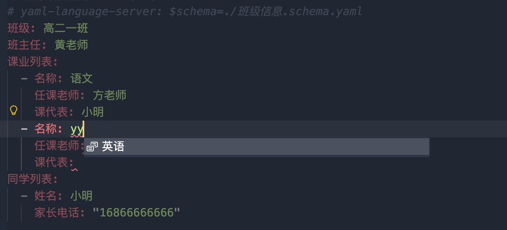

### Go

[语言插件](https://marketplace.visualstudio.com/items?itemName=golang.go)&nbsp;&nbsp;&nbsp;&nbsp;
[完整样例](https://gitee.com/remyzane/vscode-zh-completion/tree/main/sample/Go)&nbsp;&nbsp;&nbsp;&nbsp;
[效果图](https://gitee.com/remyzane/vscode-zh-completion/blob/main/images/Go.png) 
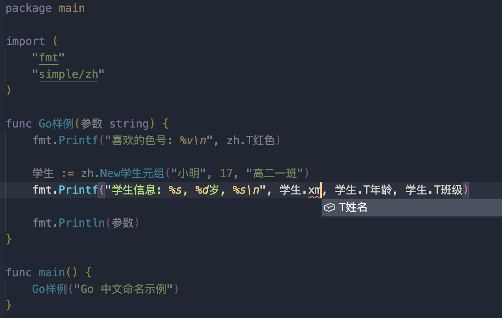
_Go包名须小写；导出标识符须大写开头（请加前缀 T，补全时插件会为您忽略 T 前缀）_

## 配置

### 输入习惯

您可以在配置文件中指定输入习惯（默认：拼音），插件会适配您的输入

|   输入习惯    |    补全码规则                                                |
| ------------- | --------------------------------------------------------- |
|    **拼音**    |   首字母相加  |
|  **五笔86版**  |   首笔画相加，最长4位，1、2、3 + 最后一位  |
|  **五笔98版**  |   同[**五笔86版**]  |
|  **声笔简拼**  |   同[**拼音**]，但首字母为 a、e、i、o、u 时，用 v 替代   |
|  **声笔简码**  |   同[**声笔简拼**]，但最长4位，1、2、3 + 最后一位  |

## 功能简介

### ✅ 无须改变输入习惯

### ⚡ 极致轻量高效

**按需加载**：仅加载你配置的输入方案（如拼音 / 五笔）

**极简码表**：特别设计的码表，内存占用极低（拼音：60 KB，五笔：20 KB）

**减少冗余**：中文命名天然具备语义，显著降低对英文注释的依赖，在**不增加中英文切换次数的前提下，同时提升代码可读性与输入效率**。

### 🌐 广泛兼容

支持主流输入习惯（详见「输入习惯配置」）

无缝适配 Python、JavaScript、Java、C++ 等主流编程语言

## 推荐

[中文命名规范](https://gitee.com/remyzane/zh-code-spec/blob/master/README.md)

## 版本更新说明

[CHANGELOG](CHANGELOG.md)

## 协议

本项目基于 BSD 3-Clause 许可证开源

## 感谢

这个项目的诞生，离不开以下项目与朋友们的帮助：

- [中文代码快速补全](https://gitee.com/Program-in-Chinese/vscode_Chinese_Input_Assistant)：主要技术参考
- [PYFL](https://www.npmjs.com/package/pyfl)：优秀的拼音首字母方案
- [PinYin.js](https://github.com/sxei/pinyinjs)：优秀的汉字转拼音方案，多音字码表魔改自这里。同时该项目也是`PYFL`项目极简首字母码表的来源。
- 正在使用的你 —— 感谢你的尝试（[如有任何问题，欢迎反馈](https://gitee.com/remyzane/vscode-zh-completion/issues)）
