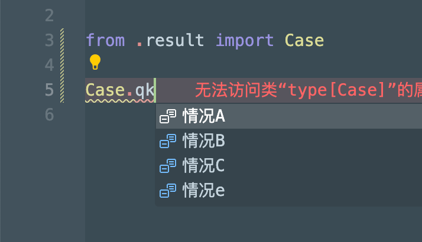

# 中文代码补全

无须切换输入法，高效补全中文变量、方法与类名，提升中文编码体验。

## 配置

### 输入习惯

您可以在配置文件中指定输入习惯（默认：拼音），插件会适配您的输入

|   输入习惯    |    补全码规则                                                |
| ------------- | --------------------------------------------------------- |
|    **拼音**    |   首字母相加  |
|  **五笔86版**  |   首笔画相加，最长4位，1、2、3 + 最后一位  |
|  **五笔98版**  |   同[**五笔86版**]  |
|  **声笔简拼**  |   同[**拼音**]，但首字母为 a、e、i、o、u 时，用 v 替代   |
|  **声笔简码**  |   同[**声笔简拼**]，但最长4位，1、2、3 + 最后一位  |

## 功能简介

### ✅ 专注一件事

**中文标识符的高效补全** —— 变量、函数、类名无需切换输入法即可直接输入，命名与注释仍使用你习惯的输入法。

支持拼音、五笔等多种输入习惯，**只需一次选择，插件即自动加载对应码表并配置好补全逻辑**。

### ⚡ 极致轻量高效

**按需加载**：仅加载你配置的输入方案（如拼音 / 五笔）

**极简码表**：特别设计的码表（20 KB），内存占用极低。（拼音模式因为要识别多音字，需要734 KB的码表，也非常小巧）

**减少冗余**：中文命名天然具备语义，显著降低对英文注释的依赖，在**不增加中英文切换次数的前提下，同时提升代码可读性与输入效率**。

### 🌐 广泛兼容

支持主流输入习惯（详见「输入习惯配置」）

无缝适配 Python、JavaScript、Java、C++ 等主流编程语言

## 效果图

为保持插件轻量，此处仅提供一张代表截图以供参考。

## 版本更新说明

[CHANGELOG](CHANGELOG.md)

## 协议

本项目基于 BSD 3-Clause 许可证开源

## 感谢

这个项目的诞生，离不开以下项目与朋友们的帮助：

- [中文代码快速补全](https://gitee.com/Program-in-Chinese/vscode_Chinese_Input_Assistant)：主要技术参考
- [PYFL](https://www.npmjs.com/package/pyfl)：优秀的拼音首字母方案
- [PinYin.js](https://github.com/sxei/pinyinjs)：优秀的汉字转拼音方案，多音字码表魔改自这里。同时该项目也是`PYFL`项目极简首字母码表的来源。
- 正在使用的你：非常感谢你的尝试，[如果你遇到任何问题，欢迎随时告诉我](https://github.com/remyzane/vscode-zh-completion/issues)
