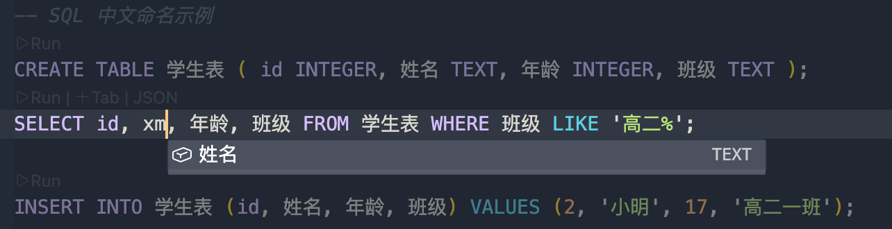

# 中文代码补全

无须切换输入法，高效补全中文变量、方法与类名，提升中文编码体验。 
用中文命名替代中文注释，在不增加中英文切换次数的同时，大幅提升代码可读性与输入效率。

## 功能特点

- **简单易用**：您只需指定自己的输入习惯（如拼音（默认）、五笔等）
- **轻量高效**：特别设计的码表，内存占用极低（拼音：60 KB，五笔：20 KB）
- **广泛兼容**：已对主流编程语言、配置格式 和 SQL 进行充分测试与兼容

## 支持的语言

|  语言 |  支持度  |    情况说明    |    效果图    |
| ---- | ------- | ------------- | ------------ |
|  C   |  优秀  |  [情况说明](https://gitee.com/remyzane/vscode-zh-completion/tree/main/sample/C) | [效果图](https://gitee.com/remyzane/vscode-zh-completion/blob/main/images/C.png)  |
|  C++  |  优秀  |  [情况说明](https://gitee.com/remyzane/vscode-zh-completion/tree/main/sample/C++) | [效果图](https://gitee.com/remyzane/vscode-zh-completion/blob/main/images/C++.png)  |
|  C#  |  良好  |  [情况说明](https://gitee.com/remyzane/vscode-zh-completion/tree/main/sample/C%23) | [效果图](https://gitee.com/remyzane/vscode-zh-completion/blob/main/images/C%23.png)  |
|  JSON |  优秀  |  [情况说明](https://gitee.com/remyzane/vscode-zh-completion/tree/main/sample/JSON) | [效果图](https://gitee.com/remyzane/vscode-zh-completion/blob/main/images/JSON.png)  |
|  YAML |  优秀  |  [情况说明](https://gitee.com/remyzane/vscode-zh-completion/tree/main/sample/YAML) | [效果图](https://gitee.com/remyzane/vscode-zh-completion/blob/main/images/YAML.png)  |
|  XML  |  良好  |  [情况说明](https://gitee.com/remyzane/vscode-zh-completion/tree/main/sample/XML) | [效果图](https://gitee.com/remyzane/vscode-zh-completion/blob/main/images/XML.png)  |
|  Rust |  优秀  |  [情况说明](https://gitee.com/remyzane/vscode-zh-completion/tree/main/sample/Rust) | [效果图](https://gitee.com/remyzane/vscode-zh-completion/blob/main/images/Rust.png)  |
|  Java |  良好  |  [情况说明](https://gitee.com/remyzane/vscode-zh-completion/tree/main/sample/Java) | [效果图](https://gitee.com/remyzane/vscode-zh-completion/blob/main/images/Java.png)  |
|  Go   |  一般  |  [情况说明](https://gitee.com/remyzane/vscode-zh-completion/tree/main/sample/Go) | [效果图](https://gitee.com/remyzane/vscode-zh-completion/blob/main/images/Go.png)  |
| JavaScript |  优秀  |  [情况说明](https://gitee.com/remyzane/vscode-zh-completion/tree/main/sample/JavaScript) | [效果图](https://gitee.com/remyzane/vscode-zh-completion/blob/main/images/JavaScript.png)  |
| TypeScript |  优秀  |  [情况说明](https://gitee.com/remyzane/vscode-zh-completion/tree/main/sample/TypeScript) | [效果图](https://gitee.com/remyzane/vscode-zh-completion/blob/main/images/TypeScript.png)  |
| Python |  良好  |  [情况说明](https://gitee.com/remyzane/vscode-zh-completion/tree/main/sample/Python) | [效果图](https://gitee.com/remyzane/vscode-zh-completion/blob/main/images/Python.png)  |
|  SQL  |  优秀  |  [情况说明](https://gitee.com/remyzane/vscode-zh-completion/tree/main/sample/SQL) | [效果图](https://gitee.com/remyzane/vscode-zh-completion/blob/main/images/SQL.png)  |
| **其他语言**  |  **支持**  |  **[使用说明](https://gitee.com/remyzane/vscode-zh-completion/tree/main/sample/Other)** |   |

## 支持的输入习惯

您可以在设置中选择自己的输入习惯（默认：拼音）

|   输入习惯    |    补全码规则                                                |
| ------------- | --------------------------------------------------------- |
|    **拼音**    |   首字母相加  |
|  **五笔86版**  |   首笔画相加，最长4位，1、2、3 + 最后一位  |
|  **五笔98版**  |   同[**五笔86版**]  |
|  **声笔简拼**  |   同[**拼音**]，但首字母为 a、e、i、o、u 时，用 v 替代   |
|  **声笔简码**  |   同[**声笔简拼**]，但最长4位，1、2、3 + 最后一位  |

## 命名规范

我们整理了一份[中文命名规范](https://gitee.com/remyzane/zh-code-spec/blob/master/README.md)，欢迎参考、使用和一起完善！

## 版本更新说明

[CHANGELOG](CHANGELOG.md)

## 问题反馈

如果您在使用中遇到任何问题，欢迎通过以下渠道提交反馈：
- [GitHub Issues](https://github.com/remyzane/vscode-zh-completion/issues)
- [Gitee Issues](https://gitee.com/remyzane/vscode-zh-completion/issues)

> 💡 **提示**：若看到重复的补全项，请无需担心 —— 这是 VS Code 的正常行为。由于补全数据可能同时来自本插件与其他语言插件，尽管内容相同，VS Code 仍会分别显示，属于预期现象。

## 开发协助

如果您对本项目感兴趣，欢迎参与开发，共同完善。

- [贡献指南](https://gitee.com/remyzane/vscode-zh-completion/blob/main/贡献指南.md)
- [技术说明](https://gitee.com/remyzane/vscode-zh-completion/blob/main/技术说明.md)

本项目基于 [BSD 3-Clause 许可证](https://opensource.org/licenses/BSD-3-Clause) 开源。

## 感谢

这个项目的诞生和成长，离不开以下项目与朋友们的帮助：

- [中文代码快速补全](https://gitee.com/Program-in-Chinese/vscode_Chinese_Input_Assistant)：主要技术参考
- [PYFL](https://www.npmjs.com/package/pyfl)：优秀的拼音首字母方案
- [PinYin.js](https://github.com/sxei/pinyinjs)：优秀的汉字转拼音方案，多音字码表魔改自这里。同时该项目也是`PYFL`项目极简首字母码表的来源。
- **正在使用的你** —— 感谢你的尝试与信任！
